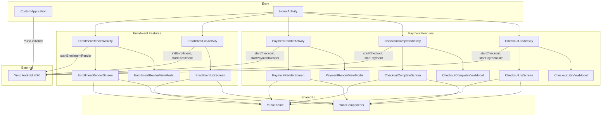

# Component Diagram

## Module Structure



## Component Descriptions

| Component | Location | Responsibility |
|-----------|----------|----------------|
| `CustomApplication` | `CustomApplication.kt` | App-level SDK initialization via `Yuno.initialize()` |
| `HomeActivity` | `ui/HomeActivity.kt` | Entry point; navigates to each demo flow |
| `HomeScreen` | `ui/HomeScreen.kt` | Home UI with cards for each integration pattern |
| `CheckoutLiteActivity` | `features/payment/activities/` | Lite payment: merchant controls payment method selection, calls `startPaymentLite()` |
| `CheckoutCompleteActivity` | `features/payment/activities/` | Full checkout: SDK provides `PaymentMethodListViewComponent`, calls `startPayment()` |
| `PaymentRenderActivity` | `features/payment/activities/` | Render payment: SDK renders payment form as Fragment via `startPaymentRender()`. Implements `YunoPaymentRenderListener` |
| `EnrollmentLiteActivity` | `features/enrollment/activities/` | Lite enrollment: SDK manages UI, calls `startEnrollment()`. Supports deep links |
| `EnrollmentRenderActivity` | `features/enrollment/activities/` | Render enrollment: SDK renders enrollment form as Fragment via `startEnrollmentRender()`. Implements `YunoEnrollmentRenderListener` |
| `*ViewModel` | `features/*/viewmodel/` | State management using sealed interfaces and `StateFlow`. Handles loading state preservation |
| `*Screen` | `features/*/ui/` | Compose UI screens with animated state transitions |
| `YunoComponents` | `ui/components/YunoComponents.kt` | Shared components: `YunoTextField`, `YunoButton`, `YunoTonalButton`, `YunoOutlinedButton`, `OttResultPanel`, `SectionHeader`, `StatusCard` |
| `YunoTheme` | `ui/theme/YunoTheme.kt` | Material 3 theme with light/dark support, extended colors for status indicators, edge-to-edge padding |

## Activity Base Class Requirements

| Flow Type | Required Base Class | Reason |
|-----------|-------------------|--------|
| Lite (payment/enrollment) | `AppCompatActivity` or `ComponentActivity` | No Fragment rendering needed |
| Complete (payment) | `AppCompatActivity` | `PaymentMethodListViewComponent` may use `supportFragmentManager` |
| Render (payment/enrollment) | `AppCompatActivity` | SDK commits Fragments via `supportFragmentManager` |

## UI State Machines

### Checkout Lite
```
Config -> PaymentEntry -> OttResult -> (continuePayment) -> Config
```

### Checkout Complete
```
Config -> PaymentList -> OttResult -> (continuePayment) -> PaymentList
```

### Payment Render
```
Config -> FragmentVisible -> OttReceived -> (continuePayment) -> StatusResult
                          -> Loading (transient overlay, preserves pre-loading state)
```

### Enrollment Render
```
Config -> FragmentVisible(needsSubmit) -> StatusResult
                                       -> Loading (transient overlay)
```
