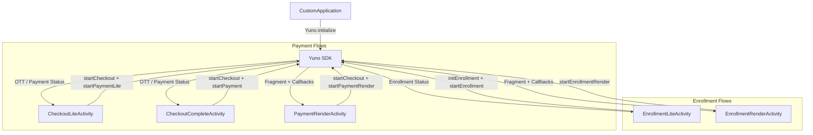
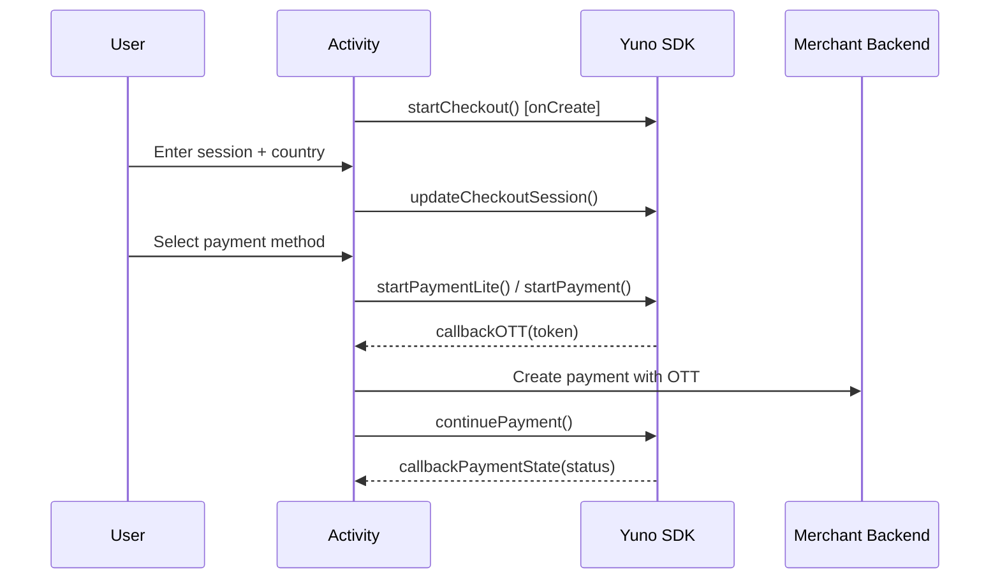
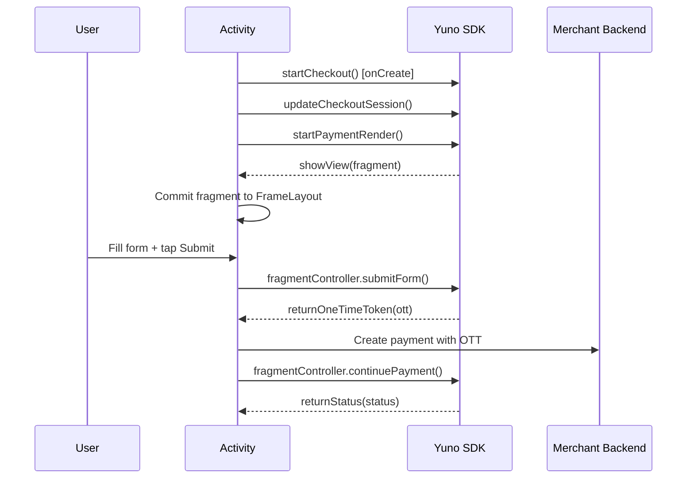

# Architecture Overview

## System Context

This repository is the **official example/demo application** for the Yuno Payments Android SDK. It demonstrates how merchants integrate the Yuno SDK into their Android apps to process payments and enroll payment methods. The app itself does not communicate with backend services directly -- all payment processing is handled by the Yuno SDK internally.

## High-Level Design

The app follows the **MVVM (Model-View-ViewModel)** architecture pattern using Android Jetpack components:

- **Activities** serve as lifecycle owners and SDK integration points. Each Activity corresponds to one SDK integration pattern.
- **ViewModels** manage UI state using Kotlin `StateFlow` and Compose `mutableStateOf`. They survive configuration changes.
- **Compose Screens** render the UI declaratively based on ViewModel state. State transitions use `AnimatedContent` and `Crossfade` for smooth animations.

There are no Repositories or data layers because the app has no backend -- the Yuno SDK handles all network communication internally.

## SDK Integration Architecture

## Data Flow

### Payment Flow (Lite / Complete)

### Payment Flow (Render)

## Dependencies

| Dependency | Version | Purpose |
|------------|---------|---------|
| `com.yuno.payments:android-sdk` | 2.12.0 | Yuno Payments SDK (from JFrog) |
| `androidx.compose.*` | 1.5.4 | Jetpack Compose UI toolkit |
| `androidx.compose.material3` | 1.1.2 | Material Design 3 components |
| `androidx.lifecycle:*` | 2.7.0 | ViewModel and lifecycle management |
| `androidx.activity:activity-compose` | 1.8.2 | Compose integration with Activities |
| `com.facebook.shimmer` | 0.5.0 | Loading shimmer effect |

## Infrastructure
- **Distribution:** JFrog Artifactory (`yunopayments.jfrog.io`)
- **CI/CD:** GitHub (yuno-payments/yuno-sdk-android)
- **Min Android version:** API 21 (Android 5.0 Lollipop)
